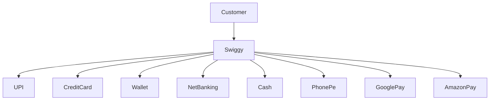
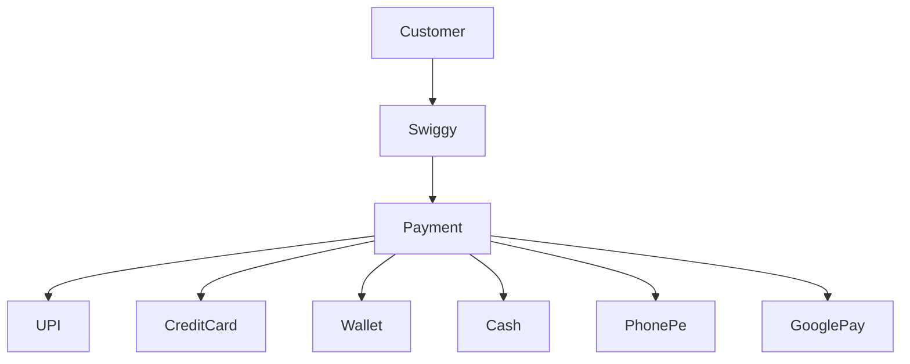

# Interfaces in Python
> **Chapter 1 – First Principles, Why Interfaces, and Real-World Design**

---

# 📖 Story

Imagine you have joined **Swiggy** as a Software Engineer.

Your manager tells you:

> "We are launching a new payment system."

Initially the application supports only **UPI**.

```
Customer
   │
   ▼
 Swiggy
   │
   ▼
 UPI
```

Everything works perfectly.

---

Two months later...

The business team says

> "Many customers want to pay using Credit Card."

Now your code becomes

```
Customer
      │
      ▼
    Swiggy
   ┌──┴───────┐
   ▼          ▼
 UPI     Credit Card
```

Again everything works.

---

Another month...

The CEO announces

```
PhonePe
Google Pay
Paytm
Credit Card
Debit Card
Net Banking
Wallet
Cash on Delivery
```

Now imagine your code.

```python
if payment == "upi":
    ...

elif payment == "credit":
    ...

elif payment == "wallet":
    ...

elif payment == "netbanking":
    ...

elif payment == "cod":
    ...

elif payment == "phonepe":
    ...

elif payment == "gpay":
    ...

...
```

Every month you keep modifying the same file.

This is a design problem.

---

# 🤔 First Principle Thinking

Before learning interfaces, ask yourself one question.

> **What does Swiggy actually care about?**

Does Swiggy care whether the payment is

- UPI?
- Credit Card?
- PayPal?
- Cash?

**No.**

Swiggy only cares about one thing.

> **"Did the payment happen successfully?"**

So instead of talking to

```
UPI

Credit Card

Wallet

PayPal
```

Swiggy should simply say

```
Pay()
```

That is the first principle behind interfaces.

---

# The Big Idea

Instead of asking

> Which payment system are you?

We ask

> Can you perform payment?

This completely changes software design.

---

# Without Interface



Notice something.

Swiggy directly knows

- UPI
- Wallet
- PhonePe
- GooglePay

Whenever a new payment arrives...

Swiggy changes.

This violates one of the most important software engineering principles.

> Software should be **open for extension but closed for modification.**

---

# The Problem

Suppose tomorrow we introduce

```
Apple Pay
```

Which file changes?

```
Swiggy
```

Next month

```
Samsung Pay
```

Again

```
Swiggy
```

Next month

```
Crypto
```

Again

```
Swiggy
```

Eventually Swiggy becomes

5000 lines long.

Every new payment breaks existing code.

---

# Real Companies Never Build Like This

Large companies design software differently.

Instead of depending on concrete classes,

they depend on **contracts**.

---

# What is a Contract?

Imagine you hire a driver.

Do you ask

```
Toyota Driver?

BMW Driver?

Tesla Driver?
```

No.

You simply ask

```
Can you drive?
```

Driving is the contract.

Which car they drive is their implementation.

Exactly the same happens in software.

---

# Interfaces

An interface says

> "Any payment system must know how to perform payment."

That's all.

It never says

```
UPI

PhonePe

GooglePay

Wallet
```

It only defines

```
pay()
```

---

# New Design



Notice something beautiful.

Swiggy only knows

```
Payment
```

It does not know

```
UPI

Wallet

Credit Card

PhonePe
```

Now adding a new payment system becomes

```
Payment

      ▲

 ApplePay
```

Swiggy never changes.

---

# Why is this powerful?

Tomorrow your manager says

> Support Bitcoin.

Old design

```
Modify Swiggy
```

New design

```
Create Bitcoin class.

Done.
```

No existing code changes.

---

# Another Real Example

Suppose you're writing a notification system.

Initially

```
Email
```

Later

```
SMS
```

Later

```
WhatsApp
```

Later

```
Slack
```

Without interfaces

```python
if type == "email":
    ...

elif type == "sms":
    ...

elif type == "whatsapp":
    ...

elif type == "slack":
    ...
```

With interfaces

```
send(message)
```

Every notification system simply implements

```
send()
```

---

# Another Real Example

Cloud Storage

```
Google Drive

Dropbox

OneDrive

AWS S3
```

Should your application know all of them?

No.

It only needs

```
upload()

download()
```

That's the contract.

---

# Another Real Example

Database Drivers

Your company supports

```
MySQL

PostgreSQL

Oracle

MongoDB
```

Your business logic shouldn't care.

It simply says

```
connect()

execute()

close()
```

Different databases implement these operations differently.

---

# Why Interfaces Exist

Interfaces help us achieve

- Loose Coupling
- Better Design
- Easy Testing
- Easy Extension
- Code Reusability
- Polymorphism

---

# Interview Question

Suppose Swiggy adds **50 payment methods**.

Which design is easier to maintain?

### Design 1

```
Swiggy knows every payment class.
```

### Design 2

```
Swiggy only knows Payment.
```

The answer is obviously **Design 2**.

That is exactly why interfaces exist.

---

# Summary

Before writing a single line of code, remember this sentence.

> **Interfaces are not about code.**
>
> **Interfaces are about reducing dependencies.**

Instead of depending on

```
UPI
```

or

```
Credit Card
```

or

```
Wallet
```

we depend on a **behavior**.

```
pay()
```

That single design decision makes software easier to maintain, extend, and test.

---

# Coming Next

In the next section we will implement this design in Python using

- `ABC`
- `@abstractmethod`

and build a production-style Payment Gateway exactly like large companies do.
