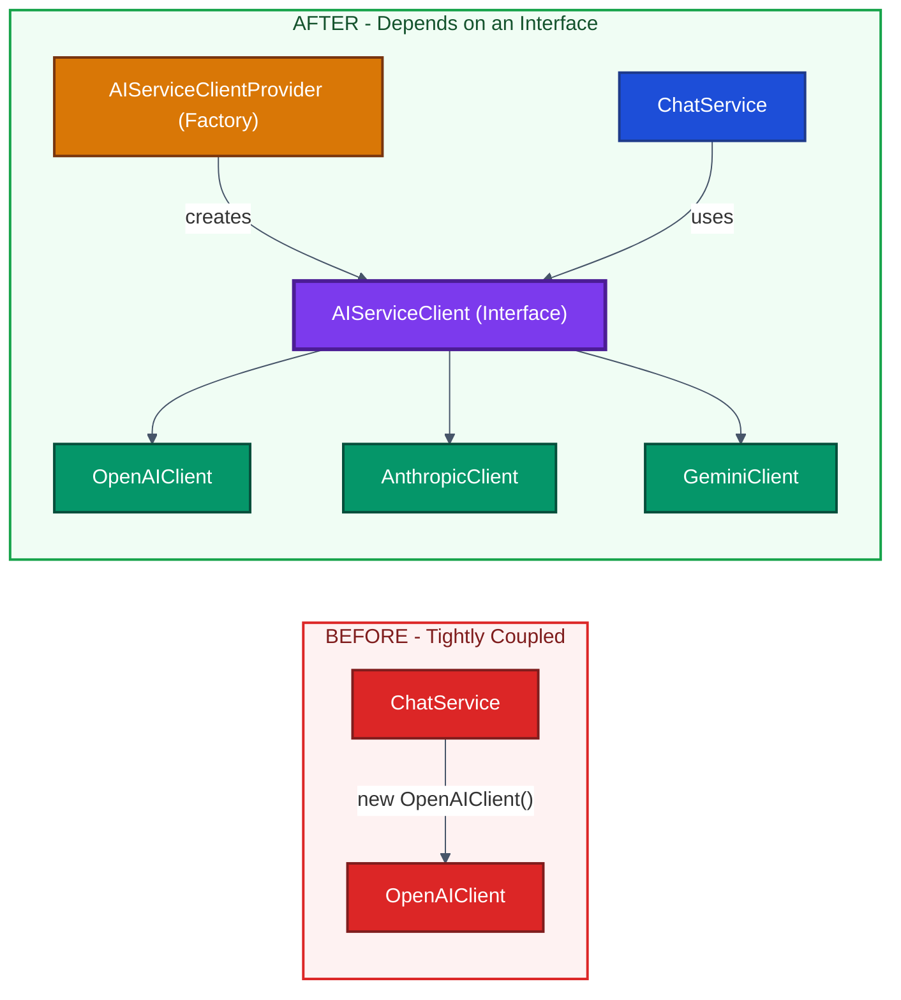
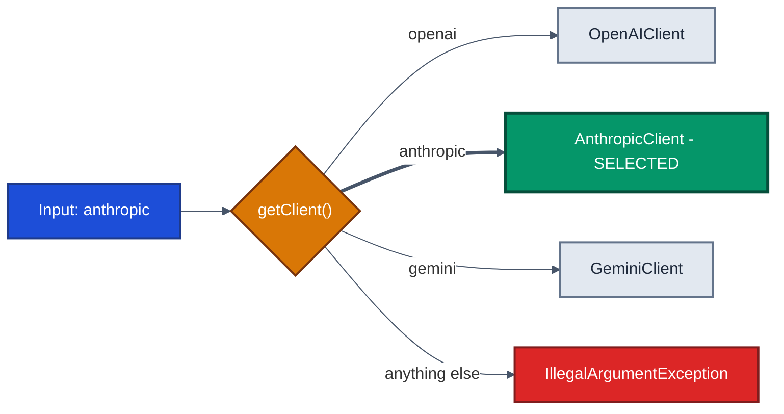
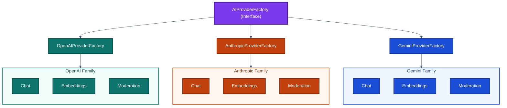
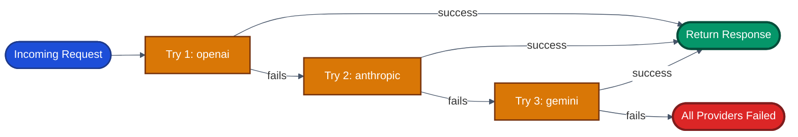

# Factory Design Pattern — A Practical Guide (with AI Service Clients in Java)

> **Module:** Design Principles & Patterns → Creational Patterns
> **Running example:** An app that can talk to **OpenAI**, **Anthropic**, or **Gemini** through one common interface, and switch between them without rewriting code.

---

## Table of Contents

1. [The Problem: Hardcoding Which Class to Build](#1-the-problem-hardcoding-which-class-to-build)
2. [The Core Idea: A Factory](#2-the-core-idea-a-factory)
3. [Simple Factory vs. GoF Factory Method](#3-simple-factory-vs-gof-factory-method)
4. [Abstract Factory: Building a Family of Objects](#4-abstract-factory-building-a-family-of-objects)
5. [Full Worked Example: `ChatService`](#5-full-worked-example-chatservice)
6. [Bonus Payoff: Failover Between Providers](#6-bonus-payoff-failover-between-providers)
7. [An Honest Note: Factories Centralize, They Don't Eliminate](#7-an-honest-note-factories-centralize-they-dont-eliminate)
8. [Making It Truly Extensible: Registry-Backed Factory](#8-making-it-truly-extensible-registry-backed-factory)
9. [Java's Built-In Solution: `ServiceLoader`](#9-javas-built-in-solution-serviceloader)
10. [Where You'll See This in Real Systems](#10-where-youll-see-this-in-real-systems)
11. [Common Mistakes](#11-common-mistakes)
12. [Quick Comparison Cheat Sheet](#12-quick-comparison-cheat-sheet)
13. [Key Terms](#13-key-terms)
14. [Interview Questions & Answers](#14-interview-questions--answers)
15. [Practice Exercises](#15-practice-exercises)

---

## 1. The Problem: Hardcoding Which Class to Build

Most creational patterns answer *"how do I build or copy this particular object?"*
The Factory pattern answers an earlier question:

> **"Which class should I even build?"** — when the answer is only known at **runtime** (from a config value, a user's choice, or which vendor is currently working).

### 1.1 A simple example: notifications

Suppose a service sends messages via SMS, Email, or Push. The first version usually looks like this:

```java
class NotificationService {

    void send(String type, String message) {
        if (type.equals("SMS")) {
            new SmsSender().send(message);
        } else if (type.equals("EMAIL")) {
            new EmailSender().send(message);
        } else if (type.equals("PUSH")) {
            new PushSender().send(message);
        }
    }
}
```

It works — until requirements change.

### 1.2 Why this breaks down

| Problem | What happens |
|---|---|
| **Open/Closed Principle is violated** | Adding WhatsApp means editing `send()` — a method that was already finished and tested. Every change to working code is a regression risk. |
| **Decision logic gets duplicated** | Other services also need to pick a channel, so the same `if/else` gets copy-pasted. A new channel now means editing 4–5 files, and it's easy to miss one. |

> 💡 **Open/Closed Principle (OCP):** Code should be *open for extension* (you can add new behavior) but *closed for modification* (you don't edit what already works).

### 1.3 The same problem with AI providers

```java
class ChatService {

    String getResponse(String prompt) {
        OpenAIClient client = new OpenAIClient();   // locked to one vendor
        return client.complete(prompt);
    }
}
```

`ChatService` is **tightly coupled** to `OpenAIClient`. If the business later wants Anthropic or Gemini too — or a backup when OpenAI is down — `ChatService` itself has to be rewritten.

### 1.4 The fix, in one picture



> **Color key:** 🟥 red = tightly coupled (bad) · 🟦 blue = caller · 🟪 purple = interface · 🟧 orange = factory · 🟩 green = concrete implementations

**The key move:** take the "which class do I build?" decision *out* of the calling service and put it in **one dedicated place** whose only job is creating the right object. The caller just asks for "something that implements `AIServiceClient`."

---

## 2. The Core Idea: A Factory

> **Factory method:** a method whose only job is to **create and return** an object — hiding *which concrete class* was chosen.

### Step 1 — Define a common interface

```java
public interface AIServiceClient {
    String complete(String prompt);
}
```

### Step 2 — Each vendor implements it

```java
public class OpenAIClient implements AIServiceClient {
    public String complete(String prompt) {
        // call OpenAI's API here
        return "response from OpenAI";
    }
}

public class AnthropicClient implements AIServiceClient {
    public String complete(String prompt) {
        // call Anthropic's API here
        return "response from Anthropic";
    }
}

public class GeminiClient implements AIServiceClient {
    public String complete(String prompt) {
        // call Google's Gemini API here
        return "response from Gemini";
    }
}
```

### Step 3 — One place decides which one to build

```java
public class AIServiceClientProvider {

    public static AIServiceClient getClient(String provider) {
        return switch (provider) {
            case "openai"    -> new OpenAIClient();
            case "anthropic" -> new AnthropicClient();
            case "gemini"    -> new GeminiClient();
            default -> throw new IllegalArgumentException("Unknown provider: " + provider);
        };
    }
}
```

### How it flows



### ⚠️ Watch out: the "God factory"

If one class slowly collects `getClient()`, `getPaymentGateway()`, `getStorageClient()`, and more, it now has many unrelated jobs — a **Single Responsibility Principle (SRP)** violation.

> ✅ **Rule of thumb:** one factory per *family* of related objects.

---

## 3. Simple Factory vs. GoF Factory Method

This is a **common interview trap**. What we built above is usually *called* "Factory Method," but strictly speaking it's something else.

### 3.1 Simple (Static) Factory — what we built

- One method (often `static`)
- Takes a parameter (string / enum)
- Uses `if/else` or `switch` to choose the class
- **Not** one of the original 23 "Gang of Four" (GoF) patterns — but extremely common in real code

### 3.2 GoF Factory Method — the textbook definition

Creation is delegated to **subclasses** through **method overriding**. Polymorphism picks the class, not a `switch`.

```java
abstract class ChatServiceCreator {

    // The "factory method" — subclasses decide what gets created
    protected abstract AIServiceClient createClient();

    public String getResponse(String prompt) {
        AIServiceClient client = createClient();
        return client.complete(prompt);
    }
}

class OpenAIChatServiceCreator extends ChatServiceCreator {
    @Override
    protected AIServiceClient createClient() {
        return new OpenAIClient();
    }
}

class AnthropicChatServiceCreator extends ChatServiceCreator {
    @Override
    protected AIServiceClient createClient() {
        return new AnthropicClient();
    }
}
```

To add Gemini, you add a **new subclass** — no existing class is edited.

### 3.3 Side-by-side

| | GoF Factory Method | Simple / Static Factory |
|---|---|---|
| Shape | Abstract `createClient()` method | One method like `getClient(name)` |
| Who decides | Subclasses override the method | `if/else` or `switch` on a parameter |
| Mechanism | Polymorphism | Conditional logic |
| Adding a provider | Add a new subclass | Add a new branch (or a `register()` call — see §8) |

> 🎯 **Interview tip:** Both hide "which class to build" behind one seam. Knowing the difference shows real understanding of the GoF catalogue.

---

## 4. Abstract Factory: Building a Family of Objects

### 4.1 The problem

Real AI SDKs offer **several related clients** per vendor:

- **Chat client** — generates text
- **Embeddings client** — turns text into number vectors (for search/similarity)
- **Moderation client** — flags unsafe content

If your app needs all three, they must come from the **same vendor**. Mixing (e.g. OpenAI chat + Gemini moderation) can cause mismatched auth, response formats, or rate limits — sometimes failing silently.

### 4.2 The solution

**Abstract Factory** = an interface that groups several related factory methods, guaranteeing a **matched family** of objects.

```java
public interface AIProviderFactory {
    ChatClient       createChatClient();
    EmbeddingsClient createEmbeddingsClient();
    ModerationClient createModerationClient();
}

public class OpenAIProviderFactory implements AIProviderFactory {
    public ChatClient       createChatClient()       { return new OpenAIChatClient(); }
    public EmbeddingsClient createEmbeddingsClient() { return new OpenAIEmbeddingsClient(); }
    public ModerationClient createModerationClient() { return new OpenAIModerationClient(); }
}

public class AnthropicProviderFactory implements AIProviderFactory {
    public ChatClient       createChatClient()       { return new AnthropicChatClient(); }
    public EmbeddingsClient createEmbeddingsClient() { return new AnthropicEmbeddingsClient(); }
    public ModerationClient createModerationClient() { return new AnthropicModerationClient(); }
}
```

Usage:

```java
AIProviderFactory factory = new OpenAIProviderFactory();

ChatClient chat             = factory.createChatClient();
EmbeddingsClient embeddings = factory.createEmbeddingsClient();
ModerationClient moderation = factory.createModerationClient();
// All three are guaranteed to be OpenAI — no accidental mixing.
```



> Each factory returns only **its own color** — a matched family. You can never get an OpenAI chat client paired with a Gemini moderation client.

### 4.3 Factory Method vs. Abstract Factory

| Factory Method | Abstract Factory |
|---|---|
| Creates **one** object | Creates a **family** of related objects |
| "Give me a chat client" | "Give me a matched chat + embeddings + moderation set" |

### 4.4 When it's overkill

If your app only ever needs **one** type of object per provider, a plain factory is enough. Use Abstract Factory only when objects **must be created together and stay matched**.

> ⚠️ **Don't** get one family member from the factory and another via `new` — that breaks the "matched family" guarantee entirely.

---

## 5. Full Worked Example: `ChatService`

With the factory from §2 in place, `ChatService` becomes simple:

```java
public class ChatService {

    private final AIServiceClient client;

    public ChatService(String provider) {
        this.client = AIServiceClientProvider.getClient(provider);
    }

    public String getResponse(String prompt) {
        return client.complete(prompt);
    }
}
```

```java
// Provider comes from config, e.g. app.ai.provider=anthropic
ChatService chat = new ChatService("anthropic");
System.out.println(chat.getResponse("Explain the Factory pattern in one line."));
```

### What happens when config changes from `openai` → `anthropic`?

1. `ChatService` is constructed with a different string.
2. The factory's `switch` returns `AnthropicClient` instead of `OpenAIClient`.
3. `getResponse()` runs **exactly the same code** — `client.complete(prompt)`.
4. `ChatService` never notices, because it only knows the **interface**.

> 🧠 **Remember:** `ChatService` knows the *interface*. The *factory* knows the vendor.

> ⚠️ Never write `new OpenAIClient()` anywhere outside the factory. Every scattered `new` is a place you'll have to hunt down and edit later.

---

## 6. Bonus Payoff: Failover Between Providers

The biggest real-world benefit: **failover** — automatically switching to a backup provider when the main one is down.

Because `ChatService` only depends on the interface, failover is a **small, safe change**. Nothing in the clients or the factory changes:

```java
public class ChatService {

    private final List<String> providerPriority;

    public ChatService(List<String> providerPriority) {
        this.providerPriority = providerPriority;
    }

    public String getResponse(String prompt) {
        for (String provider : providerPriority) {
            try {
                AIServiceClient client = AIServiceClientProvider.getClient(provider);
                return client.complete(prompt);          // success → stop here
            } catch (Exception e) {
                System.err.println("Provider '" + provider + "' failed: " + e.getMessage());
                // fall through and try the next provider
            }
        }
        throw new RuntimeException("All AI providers failed");
    }
}
```

```java
ChatService chat = new ChatService(List.of("openai", "anthropic", "gemini"));
```



The same abstraction also makes these easy: **A/B testing models**, **per-user model choice**, and **cost-based routing**.

**Pitfalls:**
- Always **log** inside the `catch` — a silent catch turns an outage into a mystery.
- Failover improves **availability**, not **consistency** — different providers may format answers differently or have different token limits.

---

## 7. An Honest Note: Factories Centralize, They Don't Eliminate

Look at `getClient()` again — the `if/else` (or `switch`) **didn't disappear**. It **moved**.

> **A factory doesn't remove the decision — it puts it in exactly ONE place**, so no one else in the codebase has to repeat it.

This is often called a **Practical Factory** or **Simple Factory**. It's a real improvement, but **centralized is not the same as extensible** — as the next section shows.

---

## 8. Making It Truly Extensible: Registry-Backed Factory

### 8.1 The test every factory should pass

Ask this question (to yourself, a teammate, or an AI assistant that designed your factory):

> *"If a **different team** needs to add a new provider next month, and they **can't edit this factory class**, how would they do it?"*

With an `if/else` factory, the honest answer is *"add another branch"* — meaning shipped code still gets reopened. The problem was hidden, not solved.

> 🤖 **Note on AI-generated code:** A vague prompt like *"design a factory for AI clients"* usually produces the clean-looking `if/else` version. To get a truly extensible design, name the property you need: *"a new provider must be addable **without editing the factory class**."*

### 8.2 The solution: a registry of creators

Replace the hardcoded chain with a **map from name → creator function**:

```java
import java.util.Map;
import java.util.concurrent.ConcurrentHashMap;
import java.util.function.Supplier;

public class AIServiceClientFactory {

    private static final Map<String, Supplier<AIServiceClient>> registry =
            new ConcurrentHashMap<>();

    public static void register(String provider, Supplier<AIServiceClient> creator) {
        registry.put(provider, creator);
    }

    public static AIServiceClient createClient(String provider) {
        Supplier<AIServiceClient> creator = registry.get(provider);
        if (creator == null) {
            throw new IllegalArgumentException("Unsupported provider: " + provider);
        }
        return creator.get();
    }
}
```

Register providers at startup:

```java
// Bootstrap code — runs once at startup
AIServiceClientFactory.register("openai",    OpenAIClient::new);
AIServiceClientFactory.register("anthropic", AnthropicClient::new);
AIServiceClientFactory.register("gemini",    GeminiClient::new);

// Later — a different team, in a different module:
AIServiceClientFactory.register("mistral",   MistralClient::new);
```

**What's new here:**
- `Supplier<AIServiceClient>` — a functional interface meaning *"a function that takes nothing and returns an `AIServiceClient`."*
- `OpenAIClient::new` — a **method reference** to the constructor. It's stored now and called later.
- `ConcurrentHashMap` — safe if registration and lookup happen on different threads.

### 8.3 Comparison

| `if/else` Factory | Registry-Backed Factory |
|---|---|
| New provider → **edit the factory** | New provider → **one `register()` call** from anywhere |
| ❌ Shipped code touched again | ✅ Factory class never changes |
| Centralized | Centralized **and** open for extension |

> ⚠️ **Registration-order bug:** if `createClient("mistral")` runs *before* `register("mistral", ...)`, it throws — even though the registration exists in the code.

---

## 9. Java's Built-In Solution: `ServiceLoader`

The registry still needs a shared place where `register(...)` calls live. Java has a built-in mechanism that removes even that: **`java.util.ServiceLoader`**.

### 9.1 How it works

Each provider module **declares itself** in a plain text file. The JDK discovers all implementations automatically at runtime.

**Step 1 — The interface stays the same:**

```java
package com.example.ai;

public interface AIServiceClient {
    String complete(String prompt);
}
```

**Step 2 — Each provider module adds a file at this exact path:**

```
src/main/resources/META-INF/services/com.example.ai.AIServiceClient
```

- **File name** = the interface's *fully qualified name*
- **File contents** = the implementing class name(s), one per line

```
com.example.ai.OpenAIClient
```

Another team's module adds its own copy of the file (inside its own JAR):

```
com.example.ai.AnthropicClient
```

**Step 3 — Load everything that's registered:**

```java
import java.util.ArrayList;
import java.util.List;
import java.util.ServiceLoader;

public class AIServiceClientProvider {

    public static AIServiceClient getFirstAvailableClient() {
        for (AIServiceClient client : ServiceLoader.load(AIServiceClient.class)) {
            return client;   // first implementation found
        }
        throw new IllegalStateException("No AIServiceClient implementations registered");
    }

    public static List<AIServiceClient> getAllRegisteredClients() {
        List<AIServiceClient> clients = new ArrayList<>();
        for (AIServiceClient client : ServiceLoader.load(AIServiceClient.class)) {
            clients.add(client);
        }
        return clients;
    }
}
```

### 9.2 Adding Mistral with `ServiceLoader`

1. The new team writes `MistralClient implements AIServiceClient`.
2. They add `com.example.ai.MistralClient` to **their own** `META-INF/services/...` file.
3. They ship their JAR.
4. On the next app restart, it's discovered. **No existing file is touched.**

### 9.3 `ServiceLoader` gotchas

| Gotcha | Why it matters |
|---|---|
| File path/name typo | `ServiceLoader` silently finds nothing — no compile error |
| Needs a **public no-arg constructor** | Config like API keys must be read inside the class (env vars, config files) |
| **No hot reload** | New JARs are picked up only when `load()` runs again — usually on restart |
| Overkill for one implementation | Worth it only when separate teams/modules genuinely add implementations |

---

## 10. Where You'll See This in Real Systems

| Domain | Factory in action |
|---|---|
| **LLM providers** | Swap OpenAI ↔ Anthropic ↔ Gemini behind `AIServiceClient` |
| **Payment gateways** | `PaymentGatewayFactory` returning Stripe, Razorpay, PayPal, UPI |
| **Cloud storage** | `StorageFactory` returning S3, GCS, or Azure Blob clients based on config |
| **JDBC drivers** | `DriverManager.getConnection("jdbc:postgresql://...")` picks the driver from the URL; drivers self-register via `META-INF/services/java.sql.Driver` |
| **Logging (SLF4J)** | `LoggerFactory.getLogger(...)` — the backend (Logback, Log4j2) is discovered from the classpath |

> The domain changes; the shape stays the same: **interface + implementations + one place that decides which to build.**

---

## 11. Common Mistakes

1. **Adding new types by editing the dispatch method** → breaks OCP.
2. **Copy-pasting the same `if/else` into multiple services** → many edits per new type; easy to miss one.
3. **Calling every creator method "Factory Method"** → confuses GoF Factory Method with Simple Factory.
4. **One factory class for unrelated families** → SRP violation.
5. **Using Abstract Factory when objects don't need to match** → needless complexity.
6. **Mixing factory-created and `new`-created family members** → breaks the matched-family guarantee.
7. **Using `new ConcreteClient()` outside the factory** → defeats centralization.
8. **Calling a design "extensible" because it works today** → run the "different team, can't edit the class" test.
9. **Assuming registries/`ServiceLoader` need no safety net** → registration order, missing files, and typos fail at runtime.
10. **Expecting `ServiceLoader` to detect new JARs live** → it requires reloading, typically a restart.
11. **Silent `catch` blocks in failover** → always log which provider failed and why.

---

## 12. Quick Comparison Cheat Sheet

| Pattern | Solves | How it decides | Add a new type by… |
|---|---|---|---|
| **Simple Factory** | "Which class do I build?" in one place | `if/else` / `switch` | Editing the factory |
| **GoF Factory Method** | Let subclasses decide what to create | Polymorphism (override) | Adding a subclass |
| **Abstract Factory** | Creating a *matched family* of objects | One concrete factory per family | Adding a new factory class |
| **Registry-Backed Factory** | Extensibility without editing the factory | Map lookup (`name → Supplier`) | Calling `register()` |
| **`ServiceLoader`** | Extensibility without any shared registration code | Classpath discovery via `META-INF/services` | Adding a service file in your module |

---

## 13. Key Terms

| Term | Simple meaning |
|---|---|
| **Factory** | Code whose job is to create and return the right object |
| **Simple / Static / Practical Factory** | One method that uses a parameter + conditionals to choose the class |
| **GoF Factory Method** | An abstract method that subclasses override to decide what to create |
| **Abstract Factory** | An interface of several factory methods producing a consistent family |
| **Registry-Backed Factory** | A factory driven by a `Map<String, Supplier<T>>` filled via `register()` |
| **`Supplier<T>`** | Functional interface: takes nothing, returns a `T` |
| **Method reference (`Class::new`)** | Shorthand pointing to a constructor, usable as a `Supplier` |
| **`ServiceLoader`** | JDK class that finds and instantiates interface implementations at runtime |
| **`META-INF/services` file** | Text file named after an interface, listing its implementation classes |
| **Failover** | Automatically switching to a backup when the primary fails |
| **Tight coupling** | A class depends directly on a specific concrete class, making it hard to swap |
| **OCP** | Open/Closed Principle — extend behavior without modifying working code |
| **SRP** | Single Responsibility Principle — a class should have one reason to change |

---

## 14. Interview Questions & Answers

<details>
<summary><b>1. What problem does a Factory solve?</b></summary>

It decides **which concrete class to instantiate** when that choice depends on runtime information (config, user input, vendor availability), and keeps that decision in one place so callers depend only on an interface.
</details>

<details>
<summary><b>2. How is GoF Factory Method different from a Simple Factory?</b></summary>

GoF Factory Method uses an **abstract method overridden by subclasses** — polymorphism picks the class. A Simple Factory is **one method with a parameter and conditional logic**. Both hide class selection, via different mechanisms.
</details>

<details>
<summary><b>3. What's wrong with hardcoding a vendor class inside a service?</b></summary>

It violates OCP (every new vendor means editing working code) and the decision logic gets duplicated across every service that needs it.
</details>

<details>
<summary><b>4. Factory Method vs. Abstract Factory?</b></summary>

Factory Method creates **one** object. Abstract Factory groups several related factory methods to create a **consistent family** of objects that must match.
</details>

<details>
<summary><b>5. When is Abstract Factory overkill?</b></summary>

When you only need one object type per provider and there's no family that must stay matched. A simple factory is enough.
</details>

<details>
<summary><b>6. Does a factory eliminate conditional logic?</b></summary>

No. It **centralizes** the decision into one place so the rest of the codebase doesn't repeat it.
</details>

<details>
<summary><b>7. Why does an if/else factory fail the extensibility test?</b></summary>

Adding a provider still requires editing the factory class. True extensibility means another team can add a provider without touching shipped code.
</details>

<details>
<summary><b>8. How does a registry-backed factory fix that?</b></summary>

New providers are added via `register(name, Class::new)` from anywhere — even another module — so the factory class never changes.
</details>

<details>
<summary><b>9. What is <code>ServiceLoader</code> and why doesn't it need <code>register()</code>?</b></summary>

It's a JDK mechanism that scans the classpath for `META-INF/services/<interface-name>` files and instantiates the listed classes. Each module declares itself, so there's no shared registration code.
</details>

<details>
<summary><b>10. Real-world examples of <code>ServiceLoader</code>-style discovery?</b></summary>

**JDBC drivers** (`DriverManager` finds drivers without hardcoding them) and **SLF4J** (discovers the logging backend on the classpath).
</details>

<details>
<summary><b>11. Why is failover a strong argument for factory-based abstraction?</b></summary>

Because callers already depend only on the interface, failover is just a loop over providers — no changes to client classes or the factory. Without it, one vendor's outage takes the whole feature down.
</details>

<details>
<summary><b>12. What's the risk of one factory handling many unrelated object types?</b></summary>

SRP violation — many unrelated reasons to change, harder to test and maintain. Give each family its own factory.
</details>

---

## 15. Practice Exercises

1. **Build the registry-backed factory** from §8 and add a fourth provider **without editing the factory class**.
2. **Extend the failover loop** in §6 to log which provider actually served each request (useful for cost and reliability tracking).
3. **Add `GeminiChatServiceCreator`** to the GoF example in §3. Did any existing class need to change?
4. **Break Abstract Factory on purpose:** write a snippet mixing a factory-made OpenAI chat client with a `new`-created Gemini moderation client. Explain what could go wrong.
5. **Trace the failover:** with `["openai", "anthropic", "gemini"]` and only `anthropic` succeeding, list every call and outcome in order.
6. **Write the `META-INF/services` file** that registers `MistralClient`, and state exactly where it lives in the project.
7. **Design a `PaymentGatewayFactory`** for Stripe, Razorpay, and PayPal. Then ask: *"How do I add a new gateway without editing this factory?"* Fix the design if it can't answer cleanly.

---

## Further Reading

- *Design Patterns: Elements of Reusable Object-Oriented Software* — Gamma, Helm, Johnson, Vlissides (the original GoF book)
- *Effective Java* — Joshua Bloch, Item 1: "Consider static factory methods instead of constructors"
- Java docs: `java.util.ServiceLoader`
- Java docs: `java.sql.DriverManager`
- SLF4J documentation on logging bindings
