# Low Level Design (LLD) — Introduction

*Class notes, turned into a tutorial.*

---

## Agenda

Here is what we will cover in this session:

1. Intro to LLD
2. What is LLD
3. Why LLD is so important
4. Module overview
5. Intro to OOP
6. Procedural programming
7. OOP

**How this course works:**

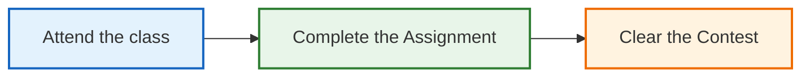

> Whatever I know, I teach everything. Nothing is held back. Your job is to show up, do the assignments, and clear the contests.

---

# 1. What is LLD?

**LLD = Low Level Design.**

Before we define it, let me tell you a story, because that is the easiest way to understand it.

## The startup story

Almost everyone, at some point in their life, dreams of starting a **startup**.

Now, as a **software engineer**, if you start a startup, your primary product is **software**. You write some code, and that code will be used by many people.

So the picture looks like this:

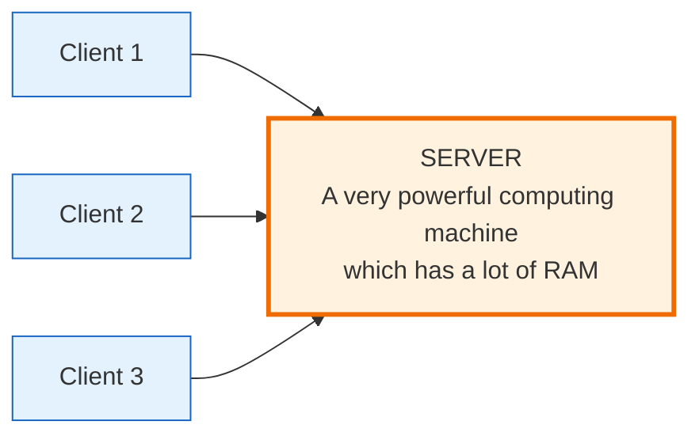

Many **clients** (users on phones, laptops, browsers) send requests to your **server**. The server is just a powerful machine with a lot of RAM and CPU that runs your code and sends back answers.

If your product is good, it becomes **famous**. And when it becomes famous:

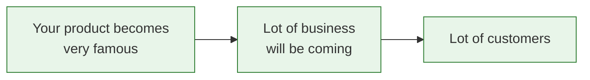

Sounds great, right? But now a real problem appears.

## The problem: can one machine serve everyone?

Ask yourself one simple question:

> Can a **single laptop**, with a certain amount of RAM and CPU, hold an **infinite** number of requests?
>
> Can it serve **infinite** requests?

**Answer: NO.**

### A simple example everyone has felt

Open **too many apps** on your phone at the same time. Does it work smoothly?

No — it **hangs**. It slows down and becomes unresponsive.

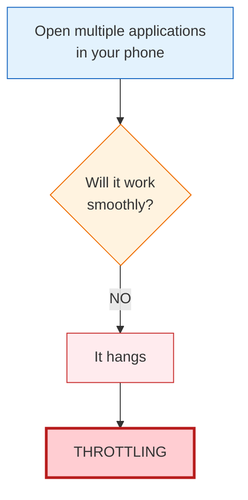

This slowing-down under heavy load has a name: **Throttling**.

The **same thing** happens to your server. When a *lot* of requests come to your server at once, it also **gets throttled** — it slows down or stops responding.

## So what do we do? Increase the capacity

When the server can't handle the load, you **increase the capacity**. There are two ways.

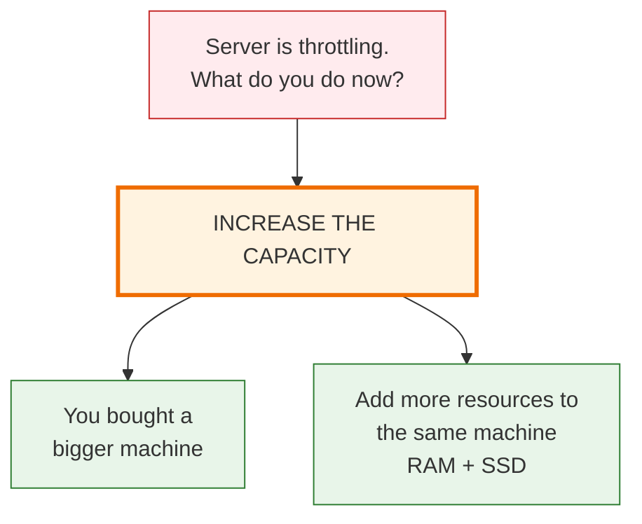

Both of these mean the same thing: *make one single machine stronger.*

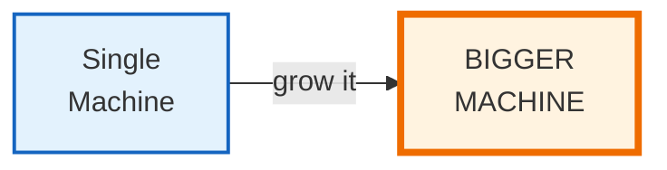

Making **one machine bigger and stronger** is called **Vertical Scaling**.

### Two big problems with vertical scaling

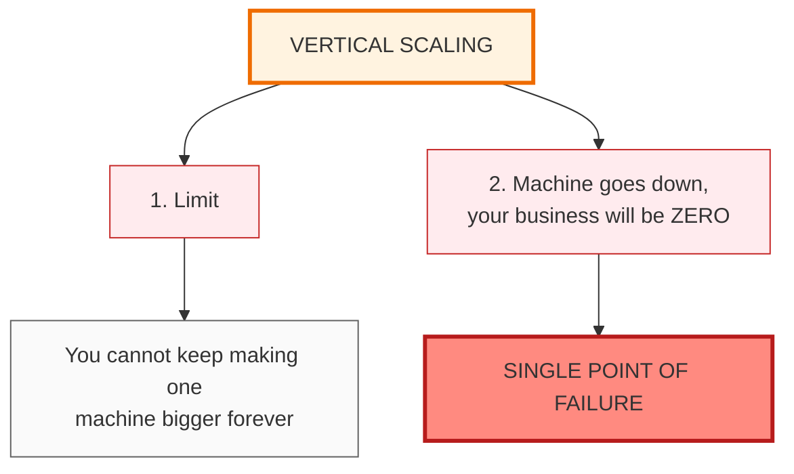

1. **There is a limit.** You cannot keep making one machine bigger forever. At some point, no bigger machine exists.

2. **Single Point of Failure.** If that one machine goes down, your **entire business becomes zero**. Everything depended on that one box.

## The better way: buy more machines

Instead of one giant machine, use **many normal machines** working together.

> Buy more machines ➡️ **Horizontal Scaling**

But now a new question: if there are many machines, *who decides which machine handles which request?* That job goes to a **Load Balancer**.

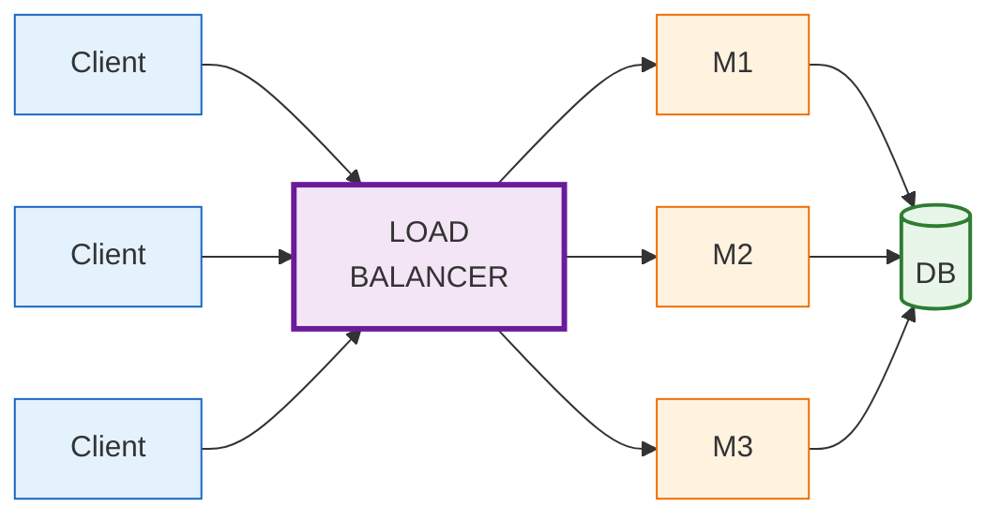

The **Load Balancer** takes all incoming requests and spreads them across machines M1, M2, M3. All machines read and write to a shared **database (DB)**.

Now if M2 dies, M1 and M3 keep serving. **No single point of failure.**

## HLD vs LLD — the key distinction

Now stop and notice something.

> Till now, did I talk about **any code**? Did I say *how do I code the server?*

**No.** I only talked about the **components** of the system — clients, server, load balancer, machines, database — and how they connect.

This type of design, where you **do not talk about code** but talk about the **components of the system**, is called **HLD**.

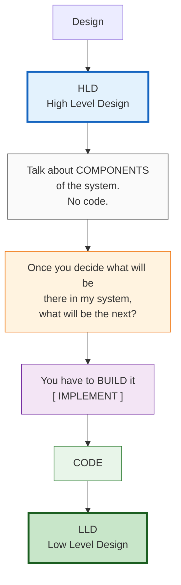

**In one line:**

| Design type | Talks about | Example |
|-------------|-------------|---------|
| **HLD** (High Level Design) | The components of the system and how they connect | Clients, load balancer, servers, DB |
| **LLD** (Low Level Design) | How to actually write the code for those components | Classes, objects, functions, relationships |

---

# 2. Why is LLD so important?

Here is a truth that surprises many beginners:

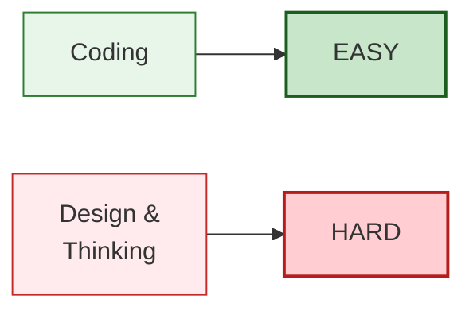

Writing *some* code that works is easy. **Designing** good code — thinking about how to structure it — is the hard part. And that thinking is exactly what LLD trains.

## The Google insight

There was a famous idea shared around *Software Engineering at Google*:

> To solve a **single problem**, there are **multiple ways** to write the code.

So when you sit down to code, your **goal** can be one of two things:

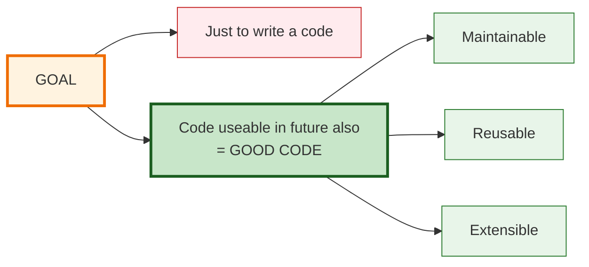

Good code is:

- **Maintainable** — easy to fix and update later.
- **Reusable** — you can use the same code in other places.
- **Extensible** — you can add new features without breaking old ones.

## The 12% that decides everything

Here is a number worth remembering:

> A Software Engineer spends only **12% of their time** on code.

What about the other **88%**?

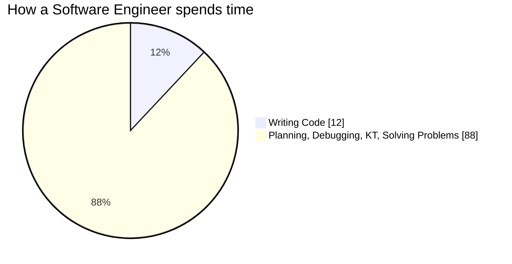

That 88% breaks down like this:

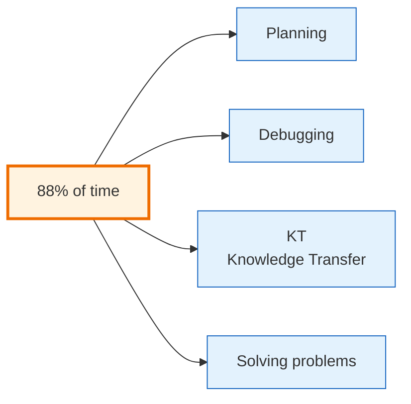

Now here is the important part:

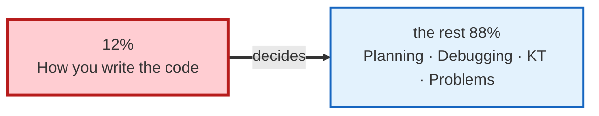

If you write messy code in that 12%, you will spend the 88% suffering — debugging, explaining, and fixing. If you write **good, well-designed code**, the other 88% becomes much easier.

**So the whole question of this course is:** *How do we make use of this 12%?*

That is what LLD teaches you.

## LLD in interviews

Nowadays the competition has increased. So **even for a fresher**, LLD is asked in interviews.

There are **3 types of LLD rounds** you may face:

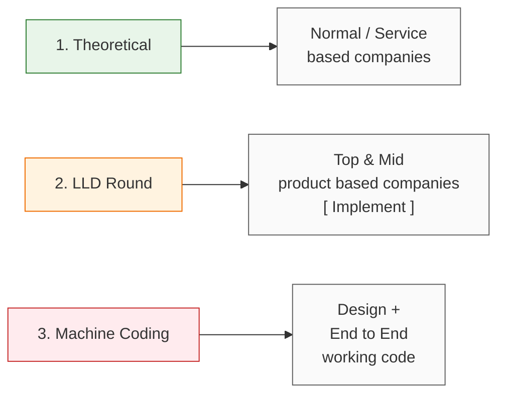

- **Theoretical** — they ask you to explain concepts. Common in normal/service companies.
- **LLD round** — you actually design and implement. Common in top and mid product-based companies.
- **Machine Coding** — the hardest: full design **plus** a complete working program.

---

# 3. Module Breakdown

Here is how the LLD course is structured:

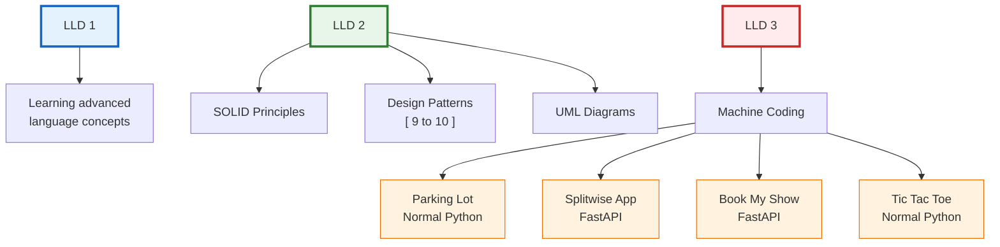

| Project | Built with |
|---------|-----------|
| Parking Lot | Normal Python |
| Splitwise App | FastAPI |
| Book My Show | FastAPI |
| Tic Tac Toe | Normal Python |

So by the end, you will not just *know* the theory — you will have **built real systems**.

---

# 4. Introduction to OOP

**OOP = Object Oriented Programming.**

To understand OOP, first understand the word **paradigm**.

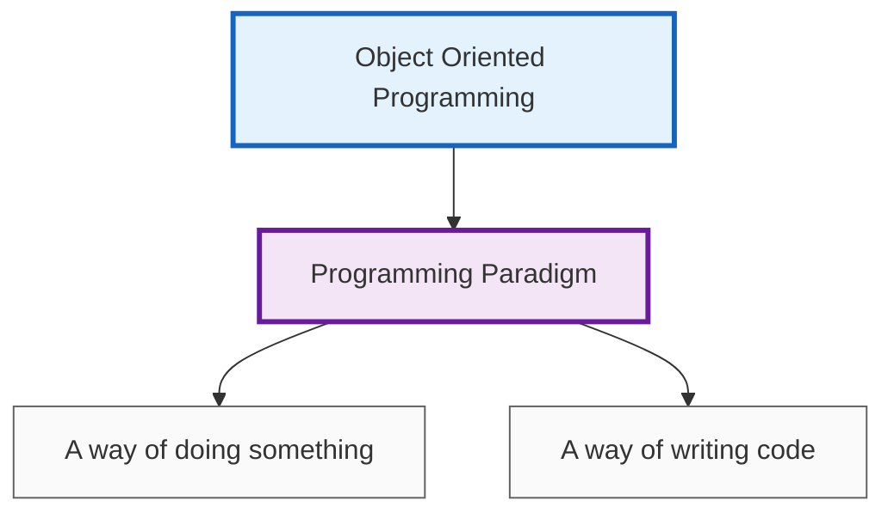

There are several programming paradigms:

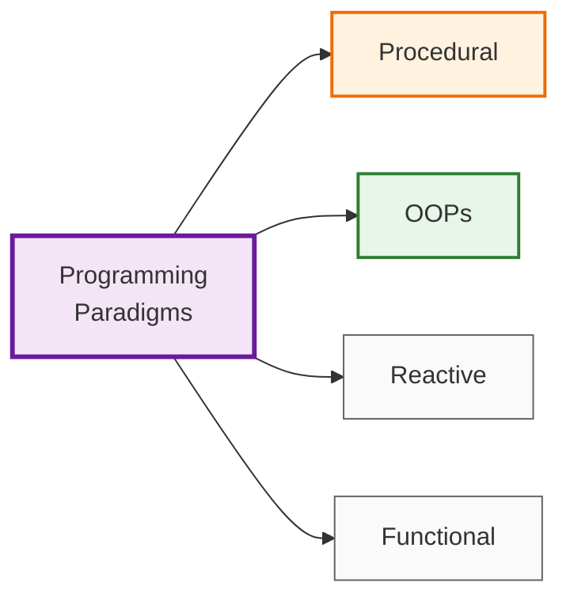

In this course we focus on the first two: **Procedural** and **OOP**. To understand *why* OOP exists, we must first see how procedural programming works — and where it breaks.

---

# 5. Procedural Programming

> **Procedural Programming** ➡️ example language: **C**

The core idea:

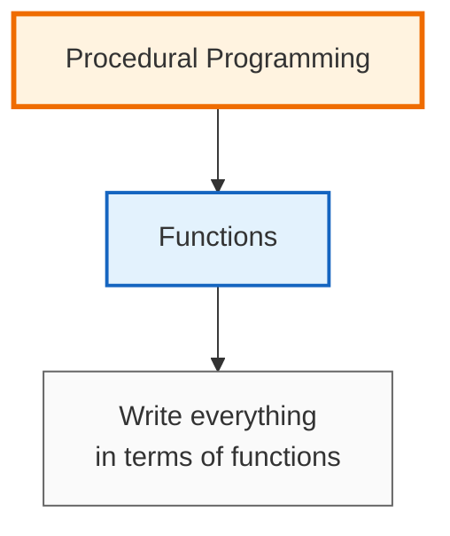

Functions are the center of the whole program. Everything is a function.

## Example: a Student Management system

Imagine we are building a system to manage students. In procedural style, we write a bunch of functions:

```c
getName();
getStudent();
solveAssignments();
updateBatch();
```

Notice something about these — they are all **actions**. They describe *how to do something*.

There are two kinds of things in any system:

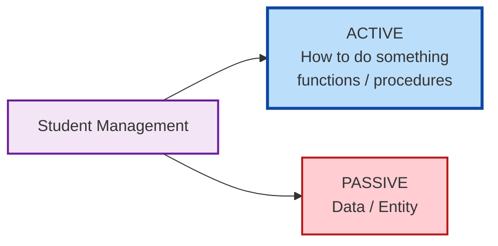

In procedural programming, the **functions (active part)** are the boss. The data just sits there, passive.

## A little history

When software engineering started, people used to code in **procedural** style.

Think about it — when computers were invented, what was the first thing a computer was used to do?

> **Calculation.**

Calculation is naturally a *function-style* task: take input, do steps, give output. So procedural made perfect sense back then.

But as systems grew bigger:

```mermaid
flowchart LR
    A["As the system<br/>started growing"] --> B["Number of functions<br/>also started growing"]
    B --> C["Hundreds of functions<br/>floating around"]

    style A fill:#e8f5e9,stroke:#2e7d32
    style B fill:#fff3e0,stroke:#ef6c00
    style C fill:#ffebee,stroke:#c62828
```

And that is where the trouble begins.

## The major problem with procedural code

> Now, what is the major issue if your **entire code is in terms of functions**?

**Problem #1: Data got mixed up.**

Look at these functions that all touch a `student`:

```c
updateBatch(student, batch);
giveGraceMarks(student);
increasePsp(student);
```

Any function, anywhere in the program, can grab the `student` data and change it. In C, when you use a `struct`:

```c
struct Student {
    char  name[50];
    int   batch;
    float psp;      // psp = problem solving percentage
};
```

> A `struct` means **everything is public**. So **every function can change** everything.

```mermaid
flowchart TD
    F1["updateBatch()"] --> D
    F2["giveGraceMarks()"] --> D
    F3["increasePsp()"] --> D
    F4["...50 other functions"] --> D

    D["struct Student<br/>name · batch · psp<br/>EVERYTHING IS PUBLIC"]

    D --> R["Data got mixed up.<br/>Who corrupted it? No idea."]

    style F1 fill:#bbdefb,stroke:#0d47a1
    style F2 fill:#bbdefb,stroke:#0d47a1
    style F3 fill:#bbdefb,stroke:#0d47a1
    style F4 fill:#bbdefb,stroke:#0d47a1
    style D fill:#fff9c4,stroke:#f57f17,stroke-width:3px
    style R fill:#ffcdd2,stroke:#b71c1c,stroke-width:3px
```

There is no protection. Fifty different functions can all reach in and modify the student's data. When something goes wrong, you have no idea *which* function corrupted it.

In procedural programming:

> **Function is the power.**

The functions are in control, and the data is exposed to all of them. That freedom is exactly what causes the mess.

---

# 6. Object Oriented Programming (OOP)

Now let's flip our thinking.

In a **real system**, what do we actually think of **first**?

Not functions. We think of **Entities**.

## Example: Uber

Think about how Uber works. The first things that come to mind are the *things* involved:

```mermaid
flowchart LR
    U["UBER"] --> C["Car"]
    U --> D["Driver"]
    U --> Cu["Customer"]

    style U fill:#212121,stroke:#000000,color:#ffffff,stroke-width:3px
    style C fill:#e8f5e9,stroke:#2e7d32,stroke-width:2px
    style D fill:#e8f5e9,stroke:#2e7d32,stroke-width:2px
    style Cu fill:#e8f5e9,stroke:#2e7d32,stroke-width:2px
```

These are **entities** — real things in the system. Notice they are **nouns** (car, driver, customer), not actions.

So OOP flips the priority:

```mermaid
flowchart LR
    subgraph PROC["PROCEDURAL"]
        direction TB
        PA["Active: Functions"]
        PP["Passive: Data"]
    end

    subgraph OOPS["OOP"]
        direction TB
        OA["Active: Entity / Objects<br/>Nouns"]
        OP["Passive: Procedures"]
    end

    PROC ==>|"flip it"| OOPS

    style PA fill:#bbdefb,stroke:#0d47a1,stroke-width:2px
    style PP fill:#ffcdd2,stroke:#b71c1c
    style OA fill:#bbdefb,stroke:#0d47a1,stroke-width:2px
    style OP fill:#ffcdd2,stroke:#b71c1c
```

In **procedural**, functions were active and data was passive.
In **OOP**, the **entities (objects)** are active, and the procedures serve them.

## The big idea: Data Ownership

This is the heart of OOP.

> **Entity owns the entire data.**

Let's take a course example — call it **CTT** — with these entities and the data each one owns:

```mermaid
flowchart LR
    C["CTT"] --> S["Student<br/>10"]
    C --> Cl["Class<br/>20"]
    C --> M["Mentor<br/>15"]
    C --> B["Batch<br/>20"]

    S --> T["Total = 65<br/>DATA OWNERSHIP"]
    Cl --> T
    M --> T
    B --> T

    style C fill:#f3e5f5,stroke:#6a1b9a,stroke-width:3px
    style S fill:#e3f2fd,stroke:#1565c0,stroke-width:2px
    style Cl fill:#e3f2fd,stroke:#1565c0,stroke-width:2px
    style M fill:#e3f2fd,stroke:#1565c0,stroke-width:2px
    style B fill:#e3f2fd,stroke:#1565c0,stroke-width:2px
    style T fill:#c8e6c9,stroke:#1b5e20,stroke-width:3px
```

Here, the `Student` entity owns its 10 pieces of data. The `Mentor` owns its 15. Nobody else reaches in and messes with them.

## Restaurant analogy

Think of a **restaurant**.

The kitchen owns the food. You, the customer, don't walk into the kitchen and start cooking or rearranging things. You place an **order**, and the kitchen decides how to handle its own food.

```mermaid
flowchart LR
    C["Customer"] -->|"places an order"| W["Waiter<br/>the method"]
    W --> K["KITCHEN<br/>owns all the food<br/>the data"]
    C -.->|"NOT ALLOWED<br/>walk in and cook"| K

    style C fill:#e3f2fd,stroke:#1565c0
    style W fill:#fff3e0,stroke:#ef6c00
    style K fill:#c8e6c9,stroke:#1b5e20,stroke-width:3px
```

That is **data ownership** — the entity that owns the data is the only one allowed to change it. Outsiders must go **through** the entity, not around it.

## Procedural vs OOP — the same code, two ways

Let's make it concrete. Here is the Student example in both styles.

**Procedural style** — data is exposed to everyone:

```python
# The data is just a loose dictionary - anyone can change anything
student = {"name": "Ashok", "batch": 1, "psp": 0}

def update_batch(student, batch):
    student["batch"] = batch          # any function can reach in

def increase_psp(student, amount):
    student["psp"] += amount

# Nothing stops some random code from doing this:
student["psp"] = 99999                # data got mixed up!
```

**OOP style** — the entity owns and protects its data:

```python
class Student:
    def __init__(self, name, batch):
        self.name  = name
        self.batch = batch
        self.psp   = 0                 # the Student OWNS this data

    def update_batch(self, batch):     # only Student's own methods
        self.batch = batch             # are meant to change it

    def increase_psp(self, amount):
        self.psp += amount


# Now you talk TO the entity, not around it:
s = Student("Ashok", batch=1)
s.update_batch(2)
s.increase_psp(10)

print(s.name, s.batch, s.psp)          # Ashok 2 10
```

See the difference? In the OOP version, the `Student` **owns** its `name`, `batch`, and `psp`. The proper way to change them is by asking the `Student` object through its own methods. The data and the behaviour live **together**, inside one entity.

## One honest trade-off

OOP is not magic — it has a cost:

> **OOP is a bit slow compared to procedural.**

Procedural code can be faster because it is simpler and closer to raw calculation. OOP adds a layer of structure (objects, ownership), which costs a little speed. But in return you get code that is **maintainable, reusable, and extensible** — and for large, growing systems, that trade is almost always worth it.

---

# Quick Recap

```mermaid
flowchart TD
    START["Today's Class"] --> A["HLD<br/>components of the system"]
    START --> B["LLD<br/>implement it as good code"]
    START --> C["Scaling"]
    START --> D["Paradigms"]

    C --> C1["Vertical - bigger machine<br/>limit + single point of failure"]
    C --> C2["Horizontal - more machines<br/>+ load balancer"]

    D --> D1["Procedural<br/>function is the power<br/>data got mixed up"]
    D --> D2["OOP<br/>entity owns the data<br/>data ownership"]

    style START fill:#f3e5f5,stroke:#6a1b9a,stroke-width:3px
    style A fill:#e3f2fd,stroke:#1565c0,stroke-width:2px
    style B fill:#c8e6c9,stroke:#1b5e20,stroke-width:2px
    style C1 fill:#ffebee,stroke:#c62828
    style C2 fill:#e8f5e9,stroke:#2e7d32
    style D1 fill:#ffebee,stroke:#c62828
    style D2 fill:#e8f5e9,stroke:#2e7d32
```

| Concept | Key idea |
|---------|----------|
| **HLD** | Design the **components** of a system (no code yet) |
| **LLD** | **Implement** those components as good code |
| **Vertical Scaling** | Make one machine bigger → has a limit + single point of failure |
| **Horizontal Scaling** | Add more machines + a load balancer → no single point of failure |
| **Throttling** | System slows down under heavy load |
| **Why LLD** | Good code = maintainable, reusable, extensible |
| **12% rule** | You code ~12% of the time, but it decides the other 88% |
| **Paradigm** | A way of writing code (Procedural, OOP, Reactive, Functional) |
| **Procedural** | Everything is a **function**; data is public → gets mixed up |
| **OOP** | Everything is an **entity (object)**; each entity **owns its data** |

**The one sentence to carry forward:**

> Procedural asks *"what functions do I need?"*
> OOP asks *"what entities exist, and what data does each one own?"*

---

# What's Next

In **LLD 1**, we start learning the **advanced language concepts** we need before we can design well. After that come **SOLID principles, design patterns, and UML** (LLD 2), and finally **machine coding** real projects like Parking Lot, Splitwise, Book My Show, and Tic Tac Toe (LLD 3).

For now, make sure you are solid on one thing: **the difference between thinking in functions (procedural) and thinking in entities that own their data (OOP).** Everything we build from here stands on that idea.

*Attend the class → complete the assignment → clear the contest. See you in the next one.*
